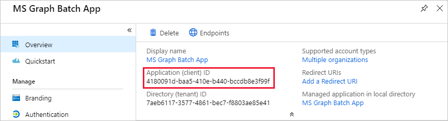

<!-- markdownlint-disable MD002 MD041 -->

Dans cet exercice, vous allez créer une nouvelle application Azure Active Directory qui sera utilisée pour fournir les autorisations déléguées pour le connecteur personnalisé.

Ouvrez un navigateur et accédez au [Centre d’administration Azure Active Directory](https://aad.portal.azure.com). Choisissez le lien **Azure Active Directory** dans le menu de navigation de gauche, puis choisissez l’entrée **inscriptions des applications** dans la section **gérer** du panneau **Azure Active Directory** .

Choisissez l’élément de menu **nouvel enregistrement** en haut du panneau **inscriptions des applications** .

Entrez `MS Graph Batch App` dans le champ **nom** . Dans la section **types de comptes pris en charge** , sélectionnez **comptes dans n’importe quel annuaire d’organisation**. Laissez la section **URI de redirection** vide, puis choisissez **inscrire**.

Sur le panneau de l’application de **lot MS Graph** , copiez l' **ID d’application (client)**. Vous en aurez besoin dans l’exercice suivant.

Choisissez l’entrée des autorisations de l' **API** dans la section **gérer** du panneau d' **application de commandes MS Graph** . Sélectionnez **Ajouter une autorisation** sous **autorisations d’API**.

Dans le panneau **autorisations d’API de demande** , sélectionnez **Microsoft Graph** , puis **autorisations déléguées**. Recherchez `group` , puis sélectionnez l’autorisation de **lecture et d’écriture de tous les groupes** . Sélectionnez **Ajouter des autorisations** au bas du panneau.

 

Choisissez l’entrée **certificats et secrets** dans la section **gérer** du panneau d' **application de commandes MS Graph** , puis choisissez **nouvelle clé secrète client**. Entrez `forever` dans la **Description** et sélectionnez **jamais** sous **expire**. Sélectionnez **Ajouter**.

Copiez la valeur de la nouvelle clé secrète. Vous en aurez besoin dans l’exercice suivant.

> [!IMPORTANT]
> Cette étape est essentielle, car le secret ne sera pas accessible une fois que vous aurez fermé cette Blade. Enregistrez cette clé secrète dans un éditeur de texte pour l’utiliser dans les exercices à venir.

Pour permettre la gestion des services supplémentaires accessibles via Microsoft Graph, y compris les propriétés Teams, vous devez sélectionner des étendues supplémentaires appropriées pour activer la gestion de services spécifiques. Par exemple, pour étendre notre solution afin de créer des blocs-notes ou des plans de planification, des compartiments et des tâches OneNote, vous devez ajouter les étendues d’autorisation requises pour les API pertinentes.
