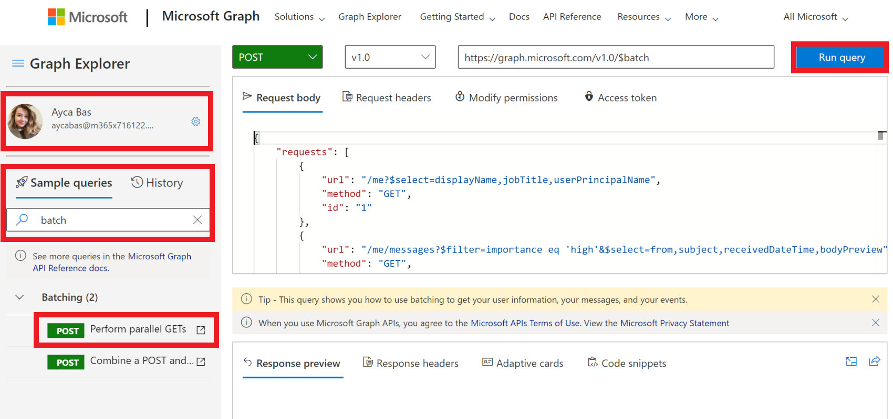
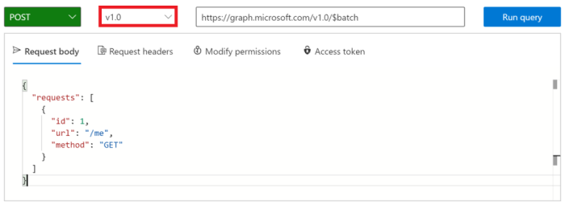

<!-- markdownlint-disable MD002 MD041 -->

Avant de créer un flux pour consommer le nouveau connecteur, utilisez l' [Explorateur Microsoft Graph](https://developer.microsoft.com/graph/graph-explorer) pour découvrir certaines des fonctionnalités de traitement par lots JSON dans Microsoft Graph.

Ouvrez l' [Explorateur Microsoft Graph](https://developer.microsoft.com/graph/graph-explorer) dans votre navigateur. Connectez-vous à l’aide de votre compte d’administrateur client Office 365. Recherchez le **lot** dans les **requêtes d’exemple**.

Sélectionnez la requête effectuer des exemples de requêtes **parallèles** dans le menu de gauche. Cliquez sur le bouton **exécuter la requête** en haut à droite de l’écran.



L’exemple d’opération par lot génère trois requêtes HTTP GET et émet un seul billet HTTP vers le `/v1.0/$batch` point de terminaison Graph.

```json
{
    "requests": [
        {
            "url": "/me?$select=displayName,jobTitle,userPrincipalName",
            "method": "GET",
            "id": "1"
        },
        {
            "url": "/me/messages?$filter=importance eq 'high'&$select=from,subject,receivedDateTime,bodyPreview",
            "method": "GET",
            "id": "2"
        },
        {
            "url": "/me/events",
            "method": "GET",
            "id": "3"
        }
    ]
}
```

La réponse renvoyée est illustrée ci-dessous. Notez le tableau des réponses renvoyées par Microsoft Graph. Les réponses aux requêtes par lots peuvent apparaître dans un ordre différent de l’ordre des demandes dans le billet. La `id` propriété doit être utilisée pour corréler les requêtes par lots individuelles avec des réponses par lots spécifiques.

> [!NOTE]
> La réponse a été tronquée pour des raisons de lisibilité.

```json
{
  "responses": [
    {
      "id": "1",
      "status": 200,
      "headers": {...},
      "body": {...}
    },
    {
      "id": "3",
      "status": 200,
      "headers": {...},
      "body": {...}
    }
    {
      "id": "2",
      "status": 200,
      "headers": {...},
      "body": {...}
    }
  ]
}
```

Chaque réponse contient une `id` propriété,, `status` `headers` , et `body` . Si la `status` propriété d’une requête indique un échec, le `body` contient toutes les informations d’erreur renvoyées par la demande.

Pour garantir l’ordre des opérations pour les demandes, les requêtes individuelles peuvent être séquencées à l’aide de la propriété [dependsOn](https://docs.microsoft.com/graph/json-batching#sequencing-requests-with-the-dependson-property) .

En plus des opérations de séquencement et de dépendance, le traitement par lots JSON suppose un chemin de base et exécute les requêtes à partir d’un chemin d’accès relatif. Chaque élément de requête par lot est exécuté à partir de l’un des `/v1.0/$batch` `/beta/$batch` points de terminaison ou, comme spécifié. Cela peut avoir des différences importantes, car le `/beta` point de terminaison peut renvoyer une sortie supplémentaire qui ne peut pas être renvoyée dans le `/v1.0` point de terminaison.

Par exemple, exécutez les deux requêtes suivantes dans l' [Explorateur Microsoft Graph](https://developer.microsoft.com/graph/graph-explorer).

1. Interrogez le `/v1.0/$batch` point de terminaison à l’aide de l’URL `/me` (copie et collage ci-dessous).

```json
{
  "requests": [
    {
      "id": 1,
      "url": "/me",
      "method": "GET"
    }
  ]
}
```



À présent, utilisez la liste déroulante sélecteur de version pour modifier le `beta` point de terminaison, puis faites exactement la même requête.


Quelles sont les différences entre les résultats renvoyés ? Essayez d’autres requêtes pour identifier certaines des différences.

En plus du contenu de réponse du `/v1.0` et des `/beta` points de terminaison, il est important de comprendre les erreurs possibles lorsqu’une demande de traitement par lots est effectuée pour laquelle le consentement des autorisations n’a pas été accordé. Par exemple, voici un élément de demande de lot pour créer un bloc-notes OneNote.

```json
{
  "id": 1,
  "url": "/groups/65c5ecf9-3311-449c-9904-29a2c76b9a50/onenote/notebooks",
  "headers": {
    "Content-Type": "application/json"
  },
  "method": "POST",
  "body": {
    "displayName": "Meeting Notes"
  }
}
```

Toutefois, si les autorisations de création de bloc-notes OneNote n’ont pas été accordées, la réponse suivante est reçue. Notez le code d’état `403 (Forbidden)` et le message d’erreur indiquant que le jeton OAuth fourni n’inclut pas les étendues requises pour effectuer l’action demandée.

```json
{
  "responses": [
    {
      "id": "1",
      "status": 403,
      "headers": {
        "Cache-Control": "no-cache"
      },
      "body": {
        "error": {
          "code": "40004",
          "message": "The OAuth token provided does not have the necessary scopes to complete the request.
            Please make sure you are including one or more of the following scopes: Notes.ReadWrite.All,
            Notes.Read.All (you provided these scopes: Group.Read.All,Group.ReadWrite.All,User.Read,User.Read.All)",
          "innerError": {
            "request-id": "92d50317-aa06-4bd7-b908-c85ee4eff0e9",
            "date": "2018-10-17T02:01:10"
          }
        }
      }
    }
  ]
}
```

Chaque demande de votre lot renverra un code d’État, des résultats ou des informations d’erreur. Vous devez traiter chacune des réponses afin de déterminer la réussite ou l’échec des opérations de traitement par lots individuels.
