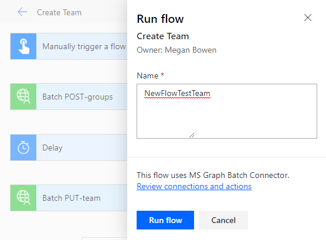

<!-- markdownlint-disable MD002 MD041 -->

Dans cet exercice, vous allez créer un flux pour utiliser le connecteur personnalisé que vous avez créé dans les exercices précédents pour créer et configurer une équipe Microsoft. Le flux utilisera le connecteur personnalisé pour envoyer une requête POST afin de créer un groupe unifié Office 365, sera suspendu pendant un délai pendant la création du groupe, puis enverra une demande PUT pour associer le groupe à une équipe Microsoft.

À la fin, votre flux ressemblera à l’image suivante :


Ouvrez [Microsoft Power automatez](https://flow.microsoft.com) -vous dans votre navigateur et connectez-vous avec votre compte d’administrateur client Office 365. Sélectionnez **mes flux** dans le volet de navigation de gauche. Sélectionnez **nouveau** , puis **instantané à partir d’un vide**. Entrez `Create Team` le **nom du flux** , puis sélectionnez **déclencher manuellement un flux** sous **Choisissez comment déclencher ce flux**. Sélectionnez **Créer**.

Sélectionnez l’option **déclencher manuellement un** élément de flux, puis choisissez **Ajouter une entrée** , sélectionnez **texte** et entrez `Name` comme titre.


Choisissez **nouvelle étape** et tapez `Batch` dans la zone de recherche. Ajoutez l’action du **connecteur de lot MS Graph** . Sélectionnez les points de suspension et renommez cette action en `Batch POST-groups` .

Ajoutez le code suivant dans la zone de texte **Body** de l’action.

```json
{
  "requests": [
    {
      "url": "/groups",
      "method": "POST",
      "id": 1,
      "headers": { "Content-Type": "application/json" },
      "body": {
        "description": "REPLACE",
        "displayName": "REPLACE",
        "groupTypes": ["Unified"],
        "mailEnabled": true,
        "mailNickname": "REPLACE",
        "securityEnabled": false
      }
    }
  ]
}
```

Remplacez chaque `REPLACE` espace réservé en sélectionnant la `Name` valeur du déclencheur manuel dans le menu **Ajouter du contenu dynamique** .


Choisissez **nouvelle étape** , recherchez `delay` et ajoutez une action de **retard** et configurez pendant 1 minute.

Choisissez **nouvelle étape** et tapez `Batch` dans la zone de recherche. Ajoutez l’action du **connecteur de lot MS Graph** . Sélectionnez les points de suspension et renommez cette action en `Batch PUT-team` .

Ajoutez le code suivant dans la zone de texte **Body** de l’action.

```json
{
  "requests": [
    {
      "id": 1,
      "url": "/groups/REPLACE/team",
      "method": "PUT",
      "headers": {
        "Content-Type": "application/json"
      },
      "body": {
        "memberSettings": {
          "allowCreateUpdateChannels": true
        },
        "messagingSettings": {
          "allowUserEditMessages": true,
          "allowUserDeleteMessages": true
        },
        "funSettings": {
          "allowGiphy": true,
          "giphyContentRating": "strict"
        }
      }
    }
  ]
}
```

Sélectionnez l' `REPLACE` espace réservé, puis **expression** dans le volet de contenu dynamique. Ajoutez la formule suivante dans l' **expression**.

```js
body('Batch_POST-groups').responses[0].body.id
```


Cette formule spécifie que nous voulons utiliser l’ID de groupe à partir du résultat de la première action.


Sélectionnez **Enregistrer** , puis **tester** pour exécuter le flux.

> [!TIP]
> Si vous recevez une erreur telle que `The template validation failed: 'The action(s) 'Batch_POST-groups' referenced by 'inputs' in action 'Batch_2' are not defined in the template'` , l’expression est incorrecte et peut faire référence à une action de flux qu’elle ne trouve pas. Vérifiez que le nom de l’action que vous référencez correspond exactement.

Sélectionnez la case d’option **j’exécuterai le déclencheur** , puis choisissez **Enregistrer & test**. Choisissez **Continuer** dans la boîte de dialogue. Fournissez un nom sans espaces, puis choisissez **exécuter le flux** pour créer une équipe.



Enfin, choisissez le pour **afficher le journal d’activité** . Une fois le flux terminé, votre groupe et votre équipe Office 365 ont été configurés. Sélectionnez les éléments d’action de traitement par lots pour afficher les résultats des appels de lots JSON. L' `outputs` `Batch PUT-team` action doit avoir un code d’état de 201 pour une association d’équipe réussie semblable à l’image ci-dessous.


